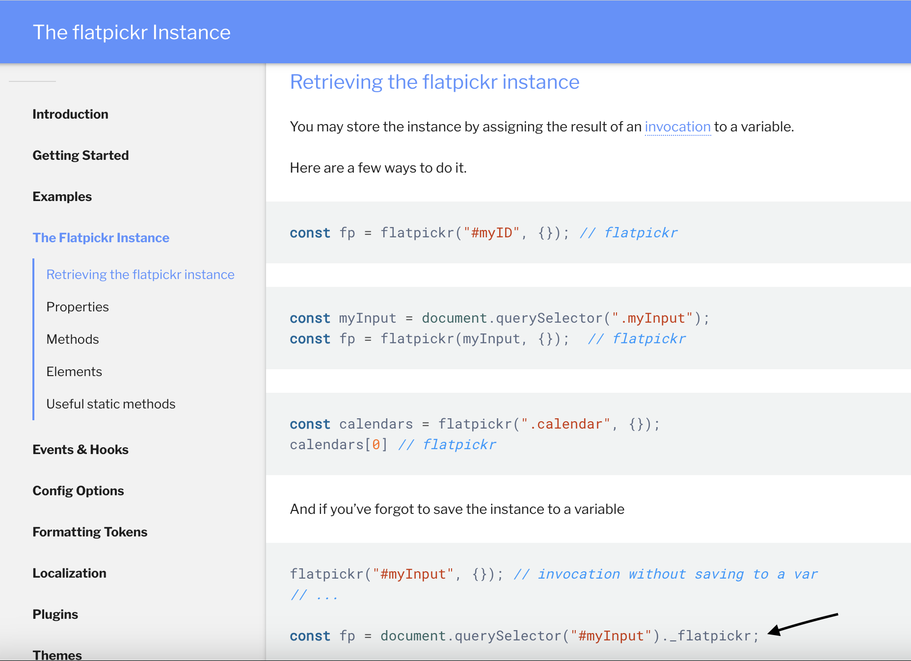

# Google_Books_Search

## Description
Your virtual bookshelf. The front end is React for a performant user experience, node.js to run JavaScript outside the browser, paired with axios to interact with a custom built RESETful API. NPM is used to easily, and quickly install packages such as concurrently, and cors. The Create React App generator was used to quickly get a React app up and running. Pages are comprised of components, and housed within a layout component that also contains a sidebar component for navigation. React router dom, and Links are used for navigation between pages. Each page routes API requesets through a private axios base URL, that uses interceptors to verify requests authorization headers. If a request fails, a new access token is retrieved from a non-relational, MongoDB database, using a refresh token that is stored upon user authentication.

Access tokens remain valid for 2 hours, while refresh tokens are valid for 1 day. Access tokens are stored on the front-end in session storage, and retrieved on the front end, when sending reqeuests through the private axios base URl. On the back end, upon authentication, if a user is found from the database, jsonwebtoken is used respond with a httpOnly cookies.

A variety of Reach hooks are used throughout the app, including useState and useEffect for page affects, useNavigate and useLocation for automatic navigation, useRef for focus, and useContext for authentication. Fontawesome icons are used in several pages as well.

The back end is powered by node.js and express for RESTAPI routing. Bcrypt is used to salt and hash passwords, if-env is used for local development, and production scripts, while both nodemon and concurrently were used in development.

This app is hosted by Heroku.

**[Check it out here!](https://blurb-books.herokuapp.com/)

## Table of Contents
* [Installation](#installation)
* [Usage](#usage)
* [License](#usage)
* [Contributing](#contributing)
* [Tests](#tests)
* [Questions](#questions)

## Installation
1. From GitHub, fork the repository, and run npm install from the root directory. 
2. Then, from the client directory, run npm install for the front end packages. 
3. From there, run npm start from the root directory, on your local machine to run the code locally.

## Usage
Visit on desktop, or mobile. This app is fully responsive.

* **Desktop**  

* **Responsive**  

## Credits
Resources:
* [Google Books APIs](https://developers.google.com/books/docs/v1/using)
* [tabnine How to use Delete Function in Router](https://www.tabnine.com/code/javascript/functions/express/Router/delete)
* [GeeksforGeeks How to make Mongoose multiple collections using Node.js](https://www.geeksforgeeks.org/how-to-make-mongoose-multiple-collections-using-node-js/)
* [MongoDB Documentation](https://docs.mongodb.com/manual/reference/method/db.createCollection/)
* [DigitalOcean Build a RESTful API using Node and Express 4](https://www.digitalocean.com/community/tutorials/build-a-restful-api-using-node-and-express-4)
* [mongoose.js Documentation](https://mongoosejs.com/)
* [DigitalOcean Introduction to Mongoose Schema Types](https://attacomsian.com/blog/mongoose-schema-types#arrays)
* [MDN Event.Target.addEventListener()](https://developer.mozilla.org/en-US/docs/Web/API/EventTarget/addEventListener)
* [MDN Aligning Items in a Flex Container](https://developer.mozilla.org/en-US/docs/Web/CSS/CSS_Flexible_Box_Layout/Aligning_Items_in_a_Flex_Container)
* [CodingDeft Fetch and Display Data from API in React js](https://www.codingdeft.com/posts/react-fetch-data-api/)
* [freeCodeCamp How To Use Axios with React.js](https://www.freecodecamp.org/news/how-to-use-axios-with-react/#how-to-make-a-put-request)
* [stackOverflow](https://stackoverflow.com/questions/55987953/how-do-i-update-states-onchange-in-an-array-of-object-in-react-hooks)
* [techozu for of loop](https://techozu.com/exit-foreach-loop-javascript/#:~:text=Officially%2C%20there%20is%20no%20proper,consider%20using%20a%20traditional%20loop.)
* [w3schools Javascript properties](https://www.w3schools.com/js/js_object_properties.asp)
* [Dmitri Palutin How to Compare Objects in Javascript](https://dmitripavlutin.com/how-to-compare-objects-in-javascript/)
* [StackAbuse Get Query Strings and Parameters in Express.js](https://stackabuse.com/get-query-strings-and-parameters-in-express-js/)
* [MongoDB Docs Queries](https://mongodb.github.io/node-mongodb-native/markdown-docs/queries.html)
* [bezkoder Node.js, Express & MongoDb: Build a CRUD Rest Api Example](https://www.bezkoder.com/node-express-mongodb-crud-rest-api/)
* [MongoDB Docs Update Operators](https://www.mongodb.com/docs/manual/reference/operator/update/#std-label-update-operators)
* [MongoDB Docs UpdateOne Method](https://www.mongodb.com/docs/manual/reference/method/db.collection.updateOne/#mongodb-method-db.collection.updateOne)
* [CSS-TRICKS A Complete Guide to Flexbox](https://css-tricks.com/snippets/css/a-guide-to-flexbox/)
* [FontAwesome](https://fontawesome.com/icons/thumbtack?s=solid)
* [MDN Aria-live](https://www.youtube.com/redirect?event=video_description&redir_token=QUFFLUhqa21naWFSbzh6UFVGVV9NMG5fR1VVZ2VHSGJYd3xBQ3Jtc0trU1JQUzg4cXRXRW9yUWNYSVBYN1lkYWRrRlFNWlhhMnZDWWIzUFBmMGpNR09QS203Z3lqUlkyZFhSc18zU09rN3JiVXlMaVJ0bElIMzdrcjBzbnZzVE9idm8xdGQ1N0xGLUVycUVJaE1OV25mLTlTcw&q=https%3A%2F%2Fdeveloper.mozilla.org%2Fen-US%2Fdocs%2FWeb%2FAccessibility%2FARIA%2FAttributes%2Faria-live&v=brcHK3P6ChQ)
* [MDN Position sticky](https://developer.mozilla.org/en-US/docs/Web/CSS/position)
* [Not a valid HTTP Header field Error](https://github.com/axios/axios/issues/5143)
* ['setRequestHeader' fails to execute with source code as a header value, axios and react](https://stackoverflow.com/questions/74166648/setrequestheader-fails-to-execute-with-source-code-as-a-header-value-axios-an/74308583#74308583)
* [React Login Authentication with JWT Access, Refresh Tokens, Cookies and Axios: Dave Gray](https://www.youtube.com/watch?v=nI8PYZNFtac&t=1979s)
* [W3Docs How to style buttons with CSS](https://www.w3docs.com/snippets/css/how-to-style-buttons-with-css.html)
* [Animated hamburger menu icons](https://hamburger-react.netlify.app/)
* [react-burger-menu](https://negomi.github.io/react-burger-menu/)
* [negomi react-burger-menu](https://github.com/negomi/react-burger-menu)
* [npm react-burger-menu](https://www.npmjs.com/package/react-burger-menu?activeTab=readme)
* [npm string-similarity](https://www.npmjs.com/package/string-similarity)
* [npm react-tooltip](https://www.npmjs.com/package/react-tooltip)
* [CSS Previous sibling selectors and how to fake them](https://medium.com/free-code-camp/how-to-make-the-impossible-possible-in-css-with-a-little-creativity-bd96bb42b29d)
* [Understanding sibling combinators in CSS: A complete guide](https://blog.logrocket.com/understanding-sibling-combinators-css/)
* [The flatpickr Instance: Retrieving the flatpickr instance](https://flatpickr.js.org/instance-methods-properties-elements/)
* **Resource that solved a difficult problem retrieving flatpickr instance**  

